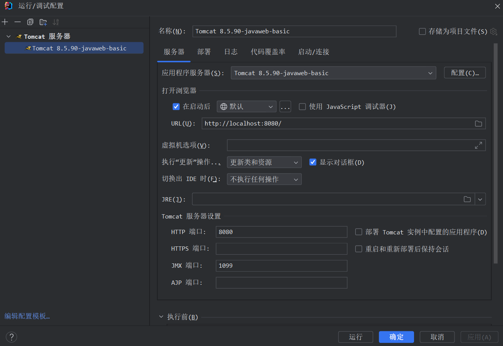
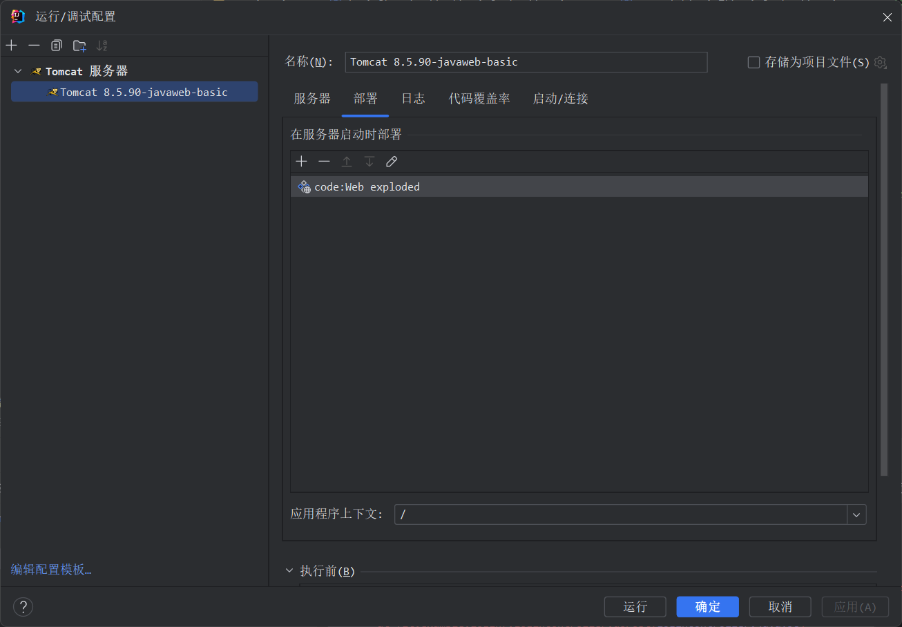
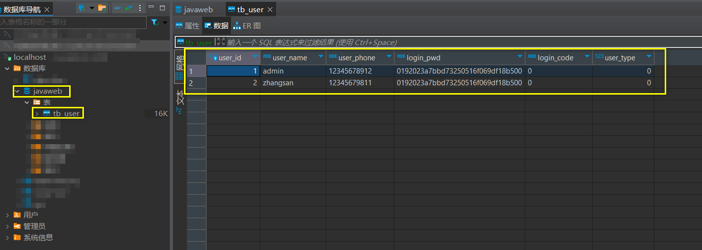
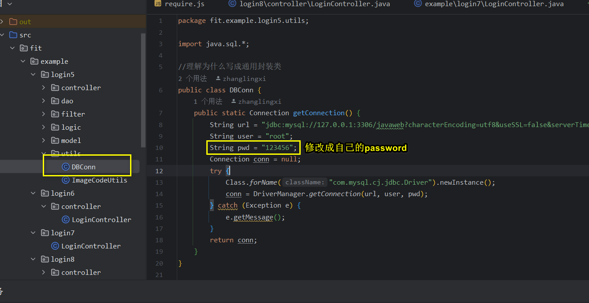
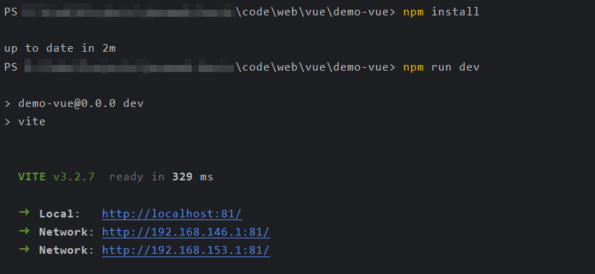

# javaweb-basic
Java Web实验课作业

## 项目结构

```
javaweb-basic
    -- code 代码
        -- src 后端代码
        -- web 前端代码
    -- resource 资源
        -- apache-tomcat-8.5.90 tomcat服务器
        -- jar 项目依赖的jar包
        -- img 图片
        -- sql sql文件
        -- nginx-1.23.1 nginx服务器
        -- Redis-x64-3.0.504.msi redis安装包
        -- Another-Redis-Desktop-Manager.1.6.1.exe Redis客户端工具
    -- .gitignore gitignore文件
    -- README.md 文档
```

## 前期工作

1. 配置tomcat服务器



2. 安装MySQL数据库，新建javaweb数据库，执行resource -> sql -> javaweb-dump.sql


3. 修改code -> src -> login5 -> utils -> DBConn.java中的配置


4. 安装Redis，resource -> Redis-x64-3.0.504.msi

## 实验5

1. http://localhost:8080/login5.jsp
2. 账户 admin 密码 admin123 | 账号 zhangsan 密码 admin123

## 实验6

1. http://localhost:8080/html/login6.html
2. 账号密码同上

## 实验7

1. http://localhost:8080/html/login7.html
2. 账号密码同上

## 实验8

在终端中打开 code -> web -> vue -> demo-vue，运行`npm install`，等待执行执行完毕，然后再运行`npm run dev`



1. http://localhost:81/login
2. 账号密码同上

## 实验9
在终端中打开 code -> web -> vue -> demo-vue，运行`npm run dev`

1. http://localhost:81/login
2. 账号密码同上
